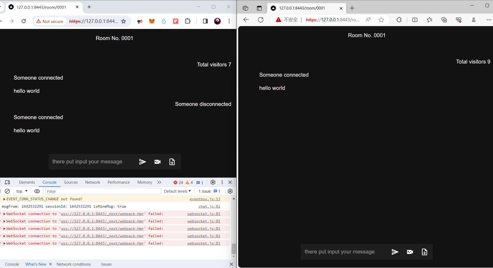
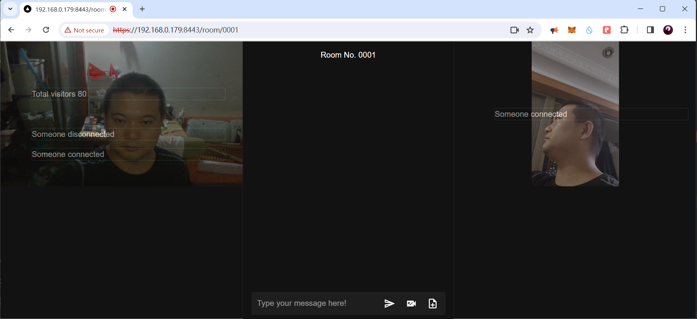

# Chat 
A chat room developed with Rust, React, webrtc, websocket, actix-web and so on.

## How to Run

First, run the development server of front-end:

```bash
npm install
npm run dev
``` 
and then run the development server of back-end:

```bash 
cd backend
cargo watch -w src -x run 
# or without hot load
cargo run 
``` 
open [https://127.0.0.1:8443/room/0001](https://127.0.0.1:8443/room/0001) in the browser 
or [http://127.0.0.1:3000/room/0001](http://127.0.0.1:3000/room/0001) 
  

Find me On [Upwork](https://www.upwork.com/signup/create-account/client_contact_freelancer?ciphertext=~017ecd3894e805207c&BYOC)
[Fusion Zhu](https://www.upwork.com/freelancers/huanqingzhu)  
